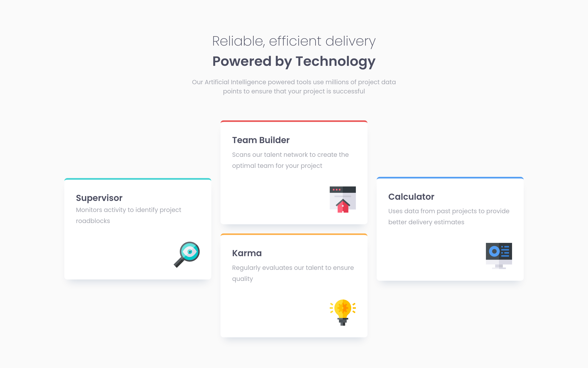

# Frontend Mentor - Four card feature section solution

This is a solution to the [Four card feature section challenge on Frontend Mentor](https://www.frontendmentor.io/challenges/four-card-feature-section-weK1eFYK). Frontend Mentor challenges help you improve your coding skills by building realistic projects.

## Table of contents

-   [Frontend Mentor - Four card feature section solution](#frontend-mentor---four-card-feature-section-solution)
    -   [Table of contents](#table-of-contents)
    -   [Overview](#overview)
        -   [The challenge](#the-challenge)
        -   [Screenshot](#screenshot)
        -   [Links](#links)
    -   [My process](#my-process)
        -   [Built with](#built-with)
        -   [What I learned](#what-i-learned)
        -   [Useful resources](#useful-resources)
    -   [Author](#author)

## Overview

### The challenge

Users should be able to:

-   View the optimal layout for the site depending on their device's screen size

### Screenshot

### Links

<!-- TODO Add Solution URL -->
<!-- - [View solution in Frontend Mentor](https://your-solution-url.com) -->

-   [Go to Demo](https://lau-san.github.io/fm-four-card-feature-section/)

## My process

### Built with

-   CSS custom properties
-   Flexbox
-   CSS Grid
-   Mobile-first workflow
-   [Sass](https://sass-lang.com)
-   [Cube CSS](https://https://cube.fyi/) - A CSS Methodology

### What I learned

I got to check out the CUBE CSS Methodology.

### Useful resources

-   [Sass, BEM and Responsive Design](https://www.youtube.com/watch?v=jfMHA8SqUL4) - Again, this course by CoderCoder helped me understand some Sass comcepts, in this case, mixins and functions.

## Author

-   Frontend Mentor - [@Lau-San](https://www.frontendmentor.io/profile/Lau-San)
